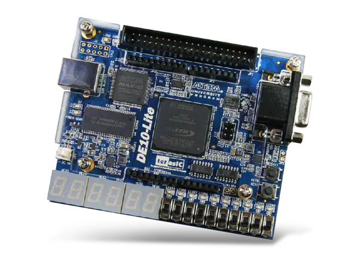
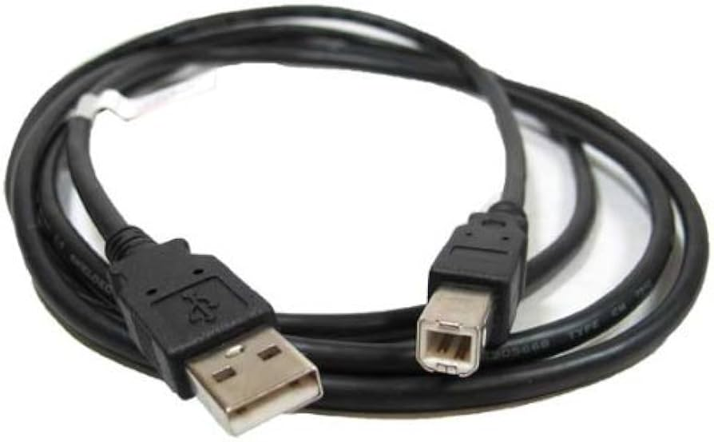

Below is the environment used to build, simulate, and program the system.

---

### Hardware
- **FPGA Board**: DE10-Lite (Intel MAX10)

- **Type A Male to Type B Male USB Cable**:

---

### Software
- **Quartus Prime Lite Edition** – for synthesis and programming the FPGA
    [Quartus Prime Lite Edition Download](https://www.intel.com/content/www/us/en/software-kit/660907/intel-quartus-prime-lite-edition-design-software-version-20-1-1-for-windows.html)
- **ModelSim Intel Edition** – for RTL simulation
     > Comes with Quartus
- **Visual Studio Code** – for Verilog development
    [Visual Studio Code Download](https://code.visualstudio.com/download)

---

### Recommended VS Code Extensions
- Verilog-HDL/SystemVerilog/Bluespec

[Back to Table Of Contents](./../../README.md)