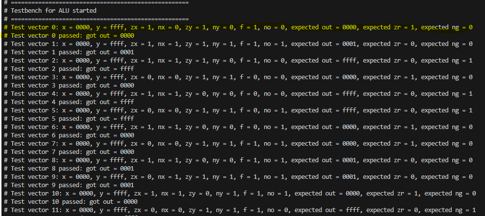
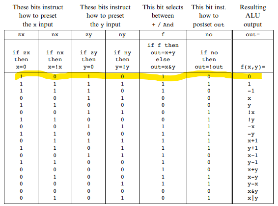

In this unit, I implemented the Arithmetic Logic Unit (ALU) of the HACK computer.  
> The code is located here: [ALU code](../../rtl/arithmetic/ALU.v)

Below is the block diagram along with its interfaces:

The ALU should obey the following truth table:

The design of the ALU can be implemented using the following sub-blocks:

For FPGA efficiency, I did not build the ALU in a purely structural manner as taught in the Nand2Tetris course. Instead, I used a mixed design of structural and behavioral models. In this implementation, I created the 'Mux16' and 'Add16' blocks.

Below is a snippet from the ALU's testbench output with the first test vector marked, along with the corresponding line marked in the truth table:

[Back to Table Of Contents](./../../README.md)
