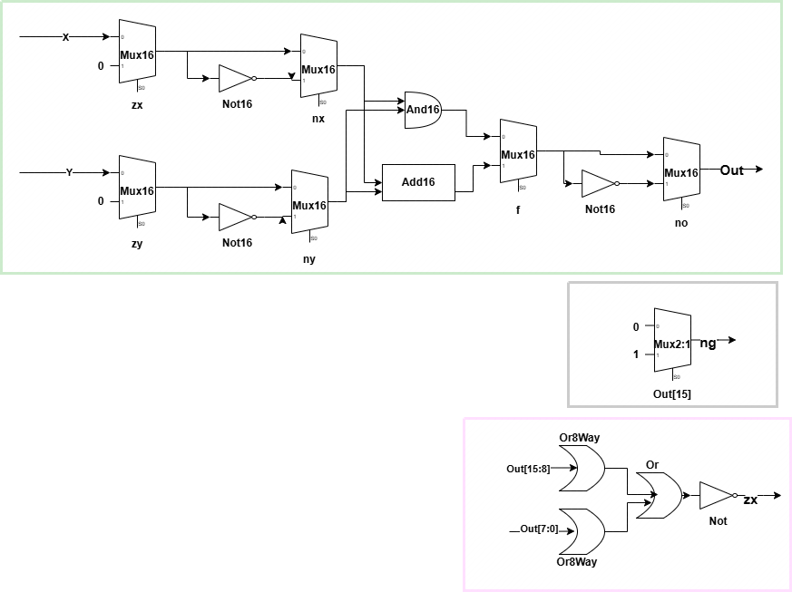

In this unit, I implemented the Arithmetic Logic Unit (ALU) of the HACK computer.  
> The code is located here: [ALU code](../../rtl/arithmetic/ALU.v)

Below is the block diagram along with its interfaces:

The ALU should obey the following truth table:

The design of the ALU can be implemented using the following sub-blocks:

[Back to Table Of Contents](./../../README.md)
